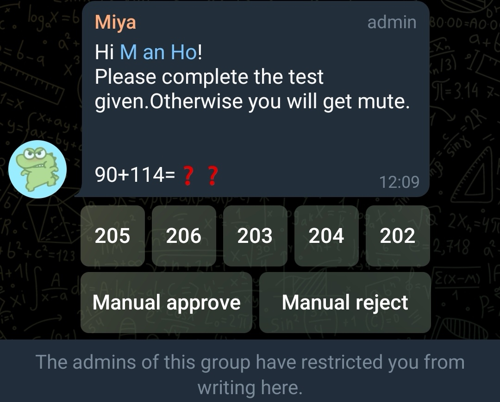
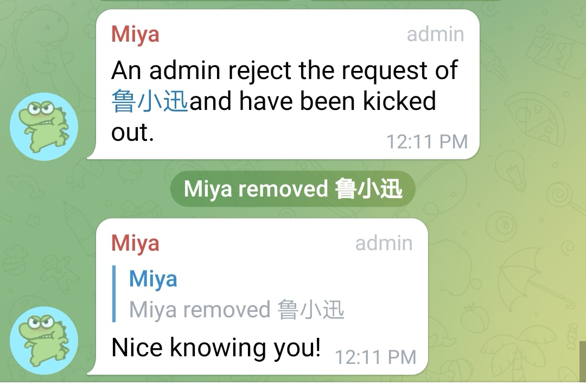
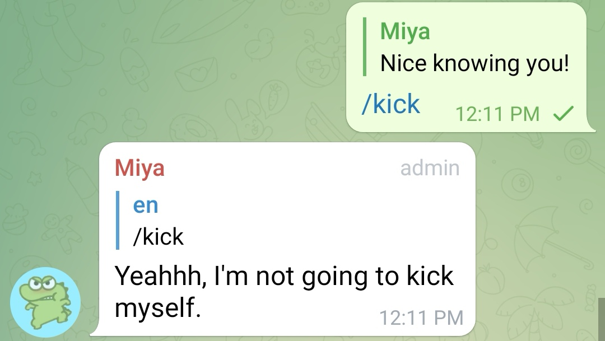
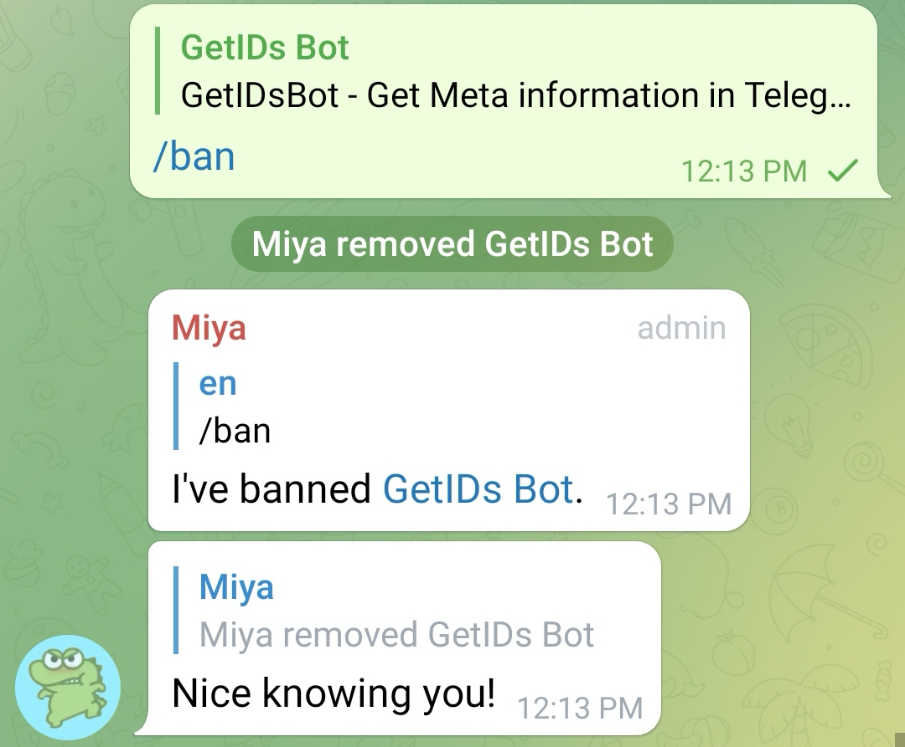
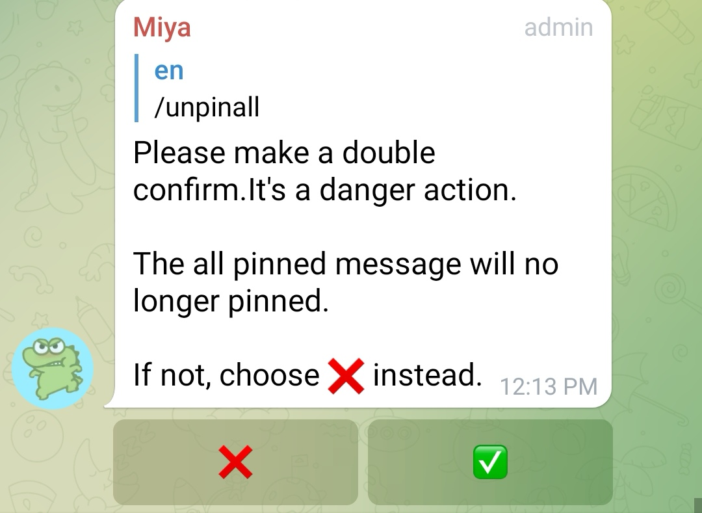

## Telegram Group manage bot
> :warning: **This README will not teaching you with deploying the bot**.<br><br>
> :heavy_exclamation_mark: **[Here is deploying tutorial](https://github.com/manho30/Telegram-Pm-Bot/blob/main/README.md)**

## What can this bot do??
- Group command
```Json
/pin - Pin a message 
/spin - Silent pin a message
/unpin - Unpin a message 
/unpinall - Unpin all message
/ban - Ban a user
/dban - Ban a user by reply, and delete their message
/sban - Silently ban a user, and delete your message
/unban - Unban a user
/kick - Kick a user
/dkick - Kick a user by reply, and delete their message
/skick - Silently kick a user, and delete your message
/mute - Mute a user
/dmute - Mute a user by reply, and delete their message
/smute - Silently mute a user, and delete your message
/unmute - Unmute a user
/rmute - Mute a user for random until time
/tmute - Accpeted (M / H / D)Example:\n==> /tmute 30m
```

**New Member Verification**
 
***Mute the new member and need to answer the questions***<br><br>
**New Member Verification rejected**
 
***Kick the member once an admin reject the request***<br><br>
**Kick bot self**
 
***She will angry 😡😡***<br><br>
**Ban Command**
 
***Ban the member by `/ban`*** <br><br>
**Unpin all**
 
***Thoughtful function with `/unpinall`***<br><br>
